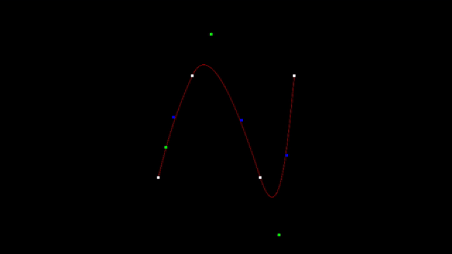

## OpenGL Bezier Splines

Works by calculating control points of 2 adjacent points (knots) and feeding them to glMap1f, then using glEvalCoordx() to generate points which join these knots smoothly. This project uses Qt to handle mouse movements, opengl context etc. This may not be the fastest or the most efficient method as I was looking forward to learn Qt and OpenGL. 

### TODO
- [x] Setup opengl along side qt and render 
- [x] Math functions, and handling points
- [x] Mouse Events handling and mouse coordinates normalizations
- [ ] Add or remove points with gui support
- [ ] Get a feedback function which has the coordinates of the points generated by glMap1f() and glEvalCoordx(). (preferrably glFeedback)
- [ ] Also show these coordinates when howevering over the graph
- [ ] Make it compatible to use in QtOpenglWidget. (this exists as a standalone program as of now)\

### DEMO

